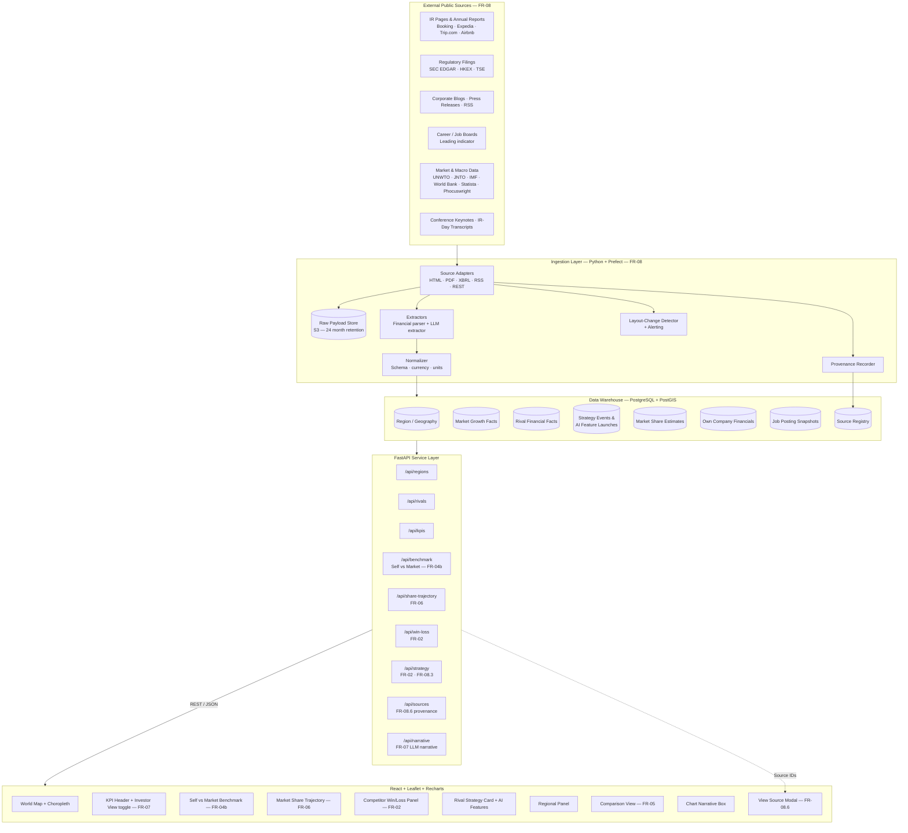
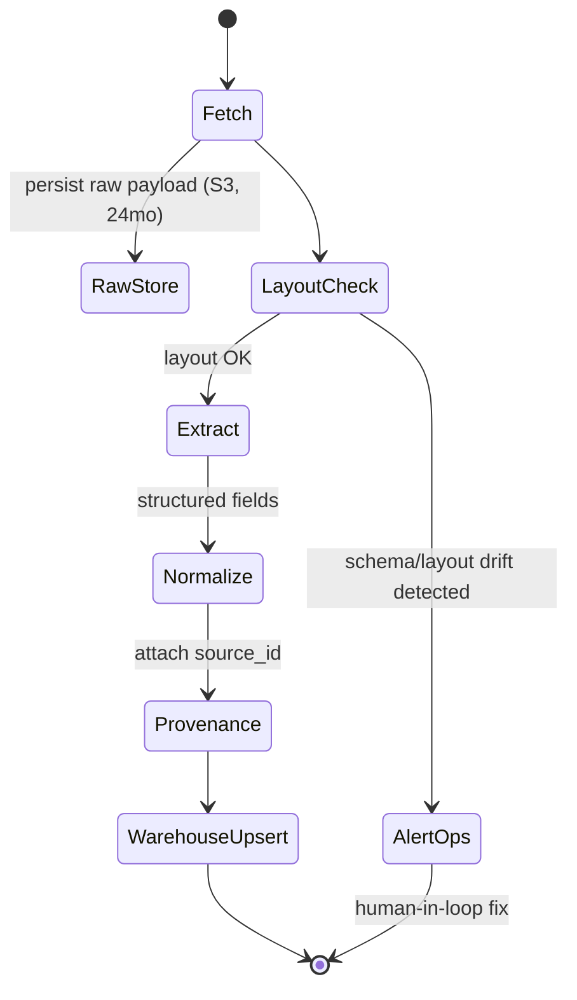
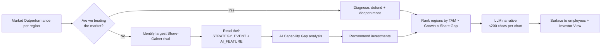

# System Design & Architecture

## Architecture Overview

The system is built in four layers — **External Sources → Ingestion → Storage → API → Frontend** — so that every figure shown to a user is derived from a real, traceable, public source (FR-08, FR-08.6). The frontend is intentionally thin: it asks the API for KPIs and renders them, while all extraction, normalization, and estimation happens upstream.



## Project Structure

```text
OTA-Worldmap/
├── frontend/                              # React 19 + TypeScript (Vite)
│   ├── index.html                         # Vite entry document
│   ├── src/
│   │   ├── main.tsx                       # React root + global CSS import
│   │   ├── App.tsx                        # Layout shell (header + map + panels)
│   │   ├── index.css                      # App styles + Leaflet CSS
│   │   ├── types.ts                       # KPI, Rival, RegionDetail, Source types
│   │   ├── api/
│   │   │   ├── regions.ts                 # /api/regions
│   │   │   ├── regionDetail.ts            # /api/regions/{iso}
│   │   │   ├── rivals.ts                  # /api/rivals
│   │   │   ├── kpis.ts                    # /api/kpis (header KPIs)
│   │   │   ├── benchmark.ts               # /api/benchmark — FR-04b
│   │   │   ├── shareTrajectory.ts         # /api/share-trajectory — FR-06
│   │   │   ├── winLoss.ts                 # /api/win-loss — FR-02
│   │   │   ├── strategy.ts                # /api/strategy — FR-02 + FR-08.3
│   │   │   ├── narrative.ts               # /api/narrative — FR-07
│   │   │   └── sources.ts                 # /api/sources — FR-08.6
│   │   ├── components/
│   │   │   ├── WorldMap.tsx               # Leaflet map + choropleth
│   │   │   ├── KpiHeader.tsx              # KPI strip + Investor View toggle (FR-07)
│   │   │   ├── KpiSelector.tsx
│   │   │   ├── SelfVsMarketChart.tsx      # FR-04b benchmark chart
│   │   │   ├── ShareTrajectoryChart.tsx   # FR-06 trajectory time-series
│   │   │   ├── WinLossPanel.tsx           # FR-02 gainer/loser labeling
│   │   │   ├── RivalStrategyCard.tsx      # Strategy summary + AI features
│   │   │   ├── RivalMarkersLayer.tsx
│   │   │   ├── RivalSummaryCard.tsx
│   │   │   ├── RivalCategoryFilter.tsx
│   │   │   ├── RegionPanel.tsx
│   │   │   ├── DemandChart.tsx
│   │   │   ├── DemographicsDonut.tsx
│   │   │   ├── RivalRankingTable.tsx
│   │   │   ├── ComparisonView.tsx         # FR-05
│   │   │   ├── ChartNarrative.tsx         # FR-07 narrative box (LLM-generated)
│   │   │   ├── InvestorViewPreset.tsx     # FR-07 preset switcher
│   │   │   ├── StaleDataBadge.tsx         # NFR-01 stale warning
│   │   │   └── ViewSourceModal.tsx        # FR-08.6 provenance UI
│   │   ├── stores/
│   │   │   ├── kpiStore.ts
│   │   │   ├── rivalStore.ts
│   │   │   ├── regionDetailStore.ts
│   │   │   ├── timeRangeStore.ts          # FR-06 selected period
│   │   │   └── investorViewStore.ts       # FR-07 preset state
│   │   └── utils/
│   │       ├── colorScale.ts
│   │       ├── colorScale.test.ts
│   │       ├── benchmarkMath.ts           # Outperformance computation
│   │       ├── trajectoryMath.ts          # Linear regression / slope
│   │       └── *.test.ts
│   ├── e2e/
│   │   └── rivals.spec.ts                 # Playwright smoke tests
│   ├── playwright.config.ts
│   ├── vite.config.ts
│   └── package.json
├── backend/                               # FastAPI + SQLAlchemy (async)
│   ├── app/
│   │   ├── main.py                        # FastAPI app + router registration
│   │   ├── config.py
│   │   ├── database.py
│   │   ├── base.py
│   │   ├── models/
│   │   │   ├── region.py                  # Region, RegionMetrics
│   │   │   ├── rival.py                   # Rival
│   │   │   ├── market_growth.py           # MarketGrowth (TAM + growth rate)
│   │   │   ├── rival_financial.py         # RivalFinancial (revenue, take rate...)
│   │   │   ├── own_financial.py           # OwnRegionalFinancial
│   │   │   ├── market_share.py            # MarketShareEstimate (FR-08.4)
│   │   │   ├── strategy_event.py          # StrategyEvent, AIFeature
│   │   │   ├── job_posting.py             # JobPostingSnapshot
│   │   │   └── source.py                  # Source registry (FR-08.6)
│   │   ├── routers/
│   │   │   ├── regions.py
│   │   │   ├── rivals.py
│   │   │   ├── kpis.py
│   │   │   ├── benchmark.py               # FR-04b
│   │   │   ├── share_trajectory.py        # FR-06
│   │   │   ├── win_loss.py                # FR-02
│   │   │   ├── strategy.py                # FR-02 + FR-08.3
│   │   │   ├── narrative.py               # FR-07
│   │   │   └── sources.py                 # FR-08.6
│   │   └── services/
│   │       ├── benchmark_service.py       # Self vs market math
│   │       ├── share_estimator.py         # FR-08.4 derivation
│   │       ├── trajectory_service.py      # Time-series slope
│   │       ├── win_loss_service.py        # Gainer/loser labeling
│   │       ├── narrative_service.py       # LLM narrative generator
│   │       └── freshness_service.py       # NFR-01 stale-data checker
│   ├── migrations/                        # Alembic migrations
│   ├── alembic.ini
│   └── requirements.txt
├── ingestion/                             # FR-08 — Python ingestion pipeline
│   ├── adapters/                          # One per source type
│   │   ├── sec_edgar.py                   # SEC EDGAR XBRL + 10-K/10-Q/20-F
│   │   ├── hkex.py                        # HKEX disclosures (Trip.com)
│   │   ├── ir_page.py                     # Generic IR HTML scraper
│   │   ├── pdf_report.py                  # PDF financial reports
│   │   ├── press_rss.py                   # RSS / Atom press feeds
│   │   ├── corporate_blog.py
│   │   ├── job_board.py                   # Career site indicators (FR-08.3)
│   │   ├── unwto.py                       # UNWTO tourism stats
│   │   ├── jnto.py                        # JNTO Japan inbound tourism
│   │   ├── world_bank.py                  # GDP, FX
│   │   ├── imf.py                         # FX rates
│   │   └── industry_research.py           # Statista / Phocuswright / Skift open
│   ├── extractors/
│   │   ├── financial_extractor.py         # XBRL + regex + LLM fallback
│   │   ├── strategy_extractor.py          # LLM strategy summarizer
│   │   └── ai_feature_extractor.py        # Detect AI feature launches
│   ├── normalizer/
│   │   ├── currency.py                    # FX conversion to USD
│   │   ├── units.py                       # Unit harmonization
│   │   └── schema.py                      # Map to warehouse schema
│   ├── provenance/
│   │   └── recorder.py                    # FR-08.6 Source persistence
│   ├── monitor/
│   │   ├── layout_change_detector.py      # FR-08.5
│   │   └── alerts.py
│   ├── flows/                             # Prefect / Airflow DAGs
│   │   ├── daily_press.py                 # NFR-01: 48h
│   │   ├── daily_filings.py               # NFR-01: 24h
│   │   ├── weekly_jobs.py                 # NFR-01: weekly
│   │   └── monthly_market.py              # NFR-01: monthly
│   ├── raw_store/                         # S3 client + 24mo retention
│   └── requirements.txt
├── data/
│   ├── geo/
│   │   └── countries.simplified.geo.json
│   └── seeds/
│       └── seed.py                        # Dev seed only — prod uses ingestion
├── docs/
│   └── walkthrough.md
├── specs/
│   ├── user_story.md
│   ├── requirements.md
│   ├── design.md
│   └── implementation_plan.md
└── docker-compose.yml
```

## Data Model

The model is organized around **fact tables backed by provenance** — every fact row carries a `source_id` foreign key into the central `SOURCE` registry (FR-08.6). Estimated values carry an `is_estimated` flag plus a `calculation_method` string (FR-08.4).

```mermaid
erDiagram
    REGION ||--o{ MARKET_GROWTH : has
    REGION ||--o{ REGION_METRICS : has
    REGION ||--o{ RIVAL_REGION_SNAPSHOT : has
    REGION ||--o{ OWN_REGIONAL_FINANCIAL : has
    REGION ||--o{ MARKET_SHARE_ESTIMATE : has
    RIVAL ||--o{ RIVAL_FINANCIAL : reports
    RIVAL ||--o{ RIVAL_REGION_SNAPSHOT : has
    RIVAL ||--o{ STRATEGY_EVENT : publishes
    RIVAL ||--o{ AI_FEATURE : launches
    RIVAL ||--o{ JOB_POSTING_SNAPSHOT : posts
    RIVAL ||--o{ MARKET_SHARE_ESTIMATE : holds
    SOURCE ||--o{ MARKET_GROWTH : sources
    SOURCE ||--o{ RIVAL_FINANCIAL : sources
    SOURCE ||--o{ STRATEGY_EVENT : sources
    SOURCE ||--o{ AI_FEATURE : sources
    SOURCE ||--o{ MARKET_SHARE_ESTIMATE : derived_from
    SOURCE ||--o{ OWN_REGIONAL_FINANCIAL : sources
    SOURCE ||--o{ JOB_POSTING_SNAPSHOT : sources

    REGION {
        string iso_code PK
        string name
        geometry boundary
        string continent
    }
    RIVAL {
        uuid id PK
        string name
        string hq_country
        string ticker
        string exchange
        string category
        string business_model
        text strategy_summary
        timestamp summary_updated_at
        string website
    }
    MARKET_GROWTH {
        uuid id PK
        string region_iso FK
        int year
        float market_size_usd
        float growth_rate_pct
        uuid source_id FK
    }
    REGION_METRICS {
        uuid id PK
        string region_iso FK
        date snapshot_month
        float avg_booking_value
        int demand_index
        jsonb top_routes
        jsonb demographics
    }
    RIVAL_FINANCIAL {
        uuid id PK
        uuid rival_id FK
        date period_end
        string period_type
        float revenue_usd
        float gross_bookings_usd
        float take_rate_pct
        float operating_margin_pct
        int room_nights
        int active_customers
        jsonb segment_breakdown
        uuid source_id FK
    }
    OWN_REGIONAL_FINANCIAL {
        uuid id PK
        string region_iso FK
        date period_end
        float revenue_usd
        float gross_bookings_usd
        float take_rate_pct
        float operating_margin_pct
        uuid source_id FK
    }
    MARKET_SHARE_ESTIMATE {
        uuid id PK
        uuid rival_id FK
        string region_iso FK
        date period_end
        float share_pct
        bool is_estimated
        text calculation_method
        uuid source_id FK
    }
    RIVAL_REGION_SNAPSHOT {
        uuid id PK
        uuid rival_id FK
        string region_iso FK
        date snapshot_month
        float market_share_pct
        int booking_volume
    }
    STRATEGY_EVENT {
        uuid id PK
        uuid rival_id FK
        date event_date
        string category
        text summary
        uuid source_id FK
    }
    AI_FEATURE {
        uuid id PK
        uuid rival_id FK
        date launch_date
        string feature_name
        text description
        uuid source_id FK
    }
    JOB_POSTING_SNAPSHOT {
        uuid id PK
        uuid rival_id FK
        date snapshot_date
        int ml_eng_count
        int data_eng_count
        int total_open_roles
        uuid source_id FK
    }
    SOURCE {
        uuid id PK
        string url
        string publisher
        string source_type
        timestamp retrieved_at
        string raw_payload_ref
        string content_hash
    }
```



---

## KPI Catalog — What We Measure and Why

The dashboard's purpose is to answer two strategic questions simultaneously per the **"知彼知己"** principle: *Are we winning vs. the market?* (Know Yourself) and *Which rivals are winning, and how?* (Know the Enemy). The KPIs below are organized to serve those questions directly, and every one is computable from the data model above.

### 1. Strategic Position KPIs (Know Yourself — 知己)

These KPIs answer "where do we stand?" and feed the **Self vs. Market Benchmark** (FR-04b) and **Investor View** (FR-07).

| KPI | Formula | Backing Tables | Refresh |
| --- | --- | --- | --- |
| **Market Outperformance** (市場超過成長率) | `own_growth_rate − market_growth_rate` | `OWN_REGIONAL_FINANCIAL` + `MARKET_GROWTH` | Quarterly |
| Own Revenue Growth (YoY) | `(rev_t − rev_{t-4Q}) / rev_{t-4Q}` | `OWN_REGIONAL_FINANCIAL` | Quarterly |
| **Own Market Share** (自社シェア) | `own_revenue / regional_market_size` | `OWN_REGIONAL_FINANCIAL` + `MARKET_GROWTH` | Quarterly |
| **Share Trajectory Slope** (シェア推移傾き) | Linear-regression slope of `share` over selected period | `MARKET_SHARE_ESTIMATE` (own rows) | Per-query |
| Share-of-Voice — AI Features | `count(own AI features in 12m) / sum(rivals + own)` | `AI_FEATURE` | Monthly |
| Own Take Rate | `own_revenue / own_gross_bookings` | `OWN_REGIONAL_FINANCIAL` | Quarterly |

### 2. Competitive Intelligence KPIs (Know the Enemy — 知彼)

These feed the **Competitor Win/Loss Panel** (FR-02) and **Rival Strategy Card** (FR-02 + FR-08.3).

| KPI | Formula | Backing Tables | Refresh |
| --- | --- | --- | --- |
| Rival Market Share per region | `rival_segment_revenue / regional_market_size` (or estimate, FR-08.4) | `RIVAL_FINANCIAL` + `MARKET_GROWTH` → `MARKET_SHARE_ESTIMATE` | Quarterly |
| **Rival Share Δ** (シェア増減) | `share_t − share_{t-1}` per rival per region | `MARKET_SHARE_ESTIMATE` | Quarterly |
| **Win/Loss Label** | `Gainer` if Δ > +0.5pp, `Loser` if Δ < −0.5pp, else `Stable` | Derived from Share Δ | Quarterly |
| Rival Take Rate | `revenue / gross_bookings` | `RIVAL_FINANCIAL` | Quarterly |
| Rival Operating Margin | `operating_income / revenue` | `RIVAL_FINANCIAL` | Quarterly |
| **AI Velocity** (AI機能投入速度) | `count(AI_FEATURE)` where `launch_date >= now-365d` per rival | `AI_FEATURE` | Daily |
| AI Investment Index (leading) | `ml_eng_count / total_open_roles` per rival | `JOB_POSTING_SNAPSHOT` | Weekly |
| Strategy Recency | `now − max(STRATEGY_EVENT.event_date)` per rival | `STRATEGY_EVENT` | Daily |

### 3. Market Health KPIs (Macro Context)

These set the **denominator** for share calculations and color the choropleth on the world map (FR-01).

| KPI | Formula | Source |
| --- | --- | --- |
| **Total Addressable Market (TAM)** per region | Sum of OTA-relevant tourism spend in USD | UNWTO + Phocuswright + Statista |
| Market Growth Rate (YoY) | `(market_size_t − market_size_{t-1}) / market_size_{t-1}` | `MARKET_GROWTH` |
| **Market Concentration (HHI)** | `Σ(share_i²)` over all tracked players in region | Derived from `MARKET_SHARE_ESTIMATE` |
| Inbound Tourist Arrivals | Annual visitor count per region | UNWTO / JNTO |
| Average Booking Value | Median per-transaction spend | `REGION_METRICS` |
| Seasonality Index | (peak month demand) / (trough month demand) | `REGION_METRICS.demand_index` |
| Top Routes | Most-booked origin-destination pairs | `REGION_METRICS.top_routes` |

The HHI (ハーフィンダール・ハーシュマン指数) tells employees whether a region is a contested battleground (low HHI) or a near-monopoly (high HHI), which dictates strategy shape.

### 4. Operational KPIs (Apples-to-Apples Comparison)

These let users compare us against rivals on the same yardsticks (FR-04b, FR-05).

| KPI | Definition |
| --- | --- |
| Gross Bookings | Total transaction value flowing through the platform |
| Net Revenue | Revenue actually retained after supplier payouts |
| Take Rate | `net_revenue / gross_bookings` — monetization efficiency |
| Room Nights / Trips | Volume metric for accommodation OTAs |
| Active Customers | Unique users transacting in trailing 12 months |
| Operating Margin | `operating_income / revenue` |
| Customer Acquisition Cost (where derivable) | `marketing_spend / new_customers` |

### 5. Investor-View Subset (FR-07 preset)

When a user toggles **Investor View (IR向けビュー)**, only these three top-line KPIs are surfaced:

1. **Market Outperformance** — did we beat the regional market growth rate this period?
2. **Own Market Share Trajectory** — 12-month rolling chart of our share.
3. **Top-3 Win/Loss Rival Deltas** — who gained or lost the most share against us.

This subset is the smallest projection of the dataset that still answers the institutional-investor's (機関投資家) core question: *Are we taking share, or losing it?*

---

## Data Source Catalog

Sources are grouped by data class and linked to the KPIs they enable and the ingestion adapter responsible for them. This catalog is the contract between FR-08 and the ingestion implementation.

| # | Source | Data Class | Adapter | KPIs Fed | Format | Cadence (NFR-01) |
| --- | --- | --- | --- | --- | --- | --- |
| 1 | **SEC EDGAR** | Regulatory filings | `sec_edgar.py` | Rival revenue, take rate, op margin, segment breakdown | XBRL + HTML | Within 24h of filing |
| 2 | **HKEX disclosures** | Regulatory filings (Trip.com) | `hkex.py` | Rival financials | HTML + PDF | Within 24h |
| 3 | **Booking Holdings IR** | Earnings | `ir_page.py` + `pdf_report.py` | Rival financials, segment | HTML + PDF | Quarterly |
| 4 | **Expedia Group IR** | Earnings | `ir_page.py` + `pdf_report.py` | Rival financials | HTML + PDF | Quarterly |
| 5 | **Airbnb IR** | Earnings | `ir_page.py` + `pdf_report.py` | Rival financials | HTML + PDF | Quarterly |
| 6 | **Trip.com IR** | Earnings | `ir_page.py` | Rival financials | HTML | Quarterly |
| 7 | **UNWTO** | Macro / tourism | `unwto.py` | TAM, inbound arrivals | API / CSV | Monthly |
| 8 | **JNTO** | Macro / Japan tourism | `jnto.py` | Japan inbound, TAM (JP) | HTML | Monthly |
| 9 | **World Bank** | Macro / GDP / FX | `world_bank.py` | TAM denominators, FX | API | Monthly |
| 10 | **IMF** | Macro / FX | `imf.py` | Currency normalization | API | Monthly |
| 11 | **Statista (free tier)** | Industry research | `industry_research.py` | Regional market size | HTML | Monthly |
| 12 | **Phocuswright open reports** | Industry research | `industry_research.py` | Sector growth rates | HTML / PDF | Quarterly |
| 13 | **Skift open content** | Industry news | `industry_research.py` | Strategy signals | HTML / RSS | Daily |
| 14 | **Rival corporate blogs** | Strategy events | `corporate_blog.py` + `press_rss.py` | AI features, M&A, partnerships | RSS / HTML | Daily |
| 15 | **Rival press release feeds** | Strategy events | `press_rss.py` | Same as above | RSS | Daily |
| 16 | **Rival career sites / LinkedIn Jobs** | Leading indicator | `job_board.py` | AI Investment Index | HTML | Weekly |
| 17 | **Conference keynote transcripts (where public)** | Strategy events | `corporate_blog.py` (generic HTML) | Strategy summary | HTML | Ad hoc |

### How Estimation Bridges Gaps (FR-08.4)

When a rival does not disclose regional revenue, the system derives `MARKET_SHARE_ESTIMATE.share_pct` as:

```
share_pct = (rival_total_revenue × regional_revenue_weight) / regional_market_size
```

where `regional_revenue_weight` is taken from the rival's most recent disclosed geographic segment breakdown (or, failing that, from public proxies like inbound-tourism share). The `is_estimated` flag and the formula are both surfaced in the **View Source** modal so users never confuse a derivation for a disclosed fact.

---

## Ingestion Pipeline Design (FR-08)



**Design principles:**

1. **Adapter-per-source** — each external site/API has one adapter that returns *raw bytes* and *parsed records*; this keeps source-specific quirks isolated.
2. **Raw-first** — every fetched payload is written to S3 *before* any parsing, so we can reprocess after extractor bug fixes without re-fetching (FR-08.5 retention).
3. **Idempotent jobs** — keyed by `(source_id, period_end)`; reruns upsert by natural key, never duplicate.
4. **Provenance is mandatory** — the normalizer refuses to emit any fact row without a `source_id`, so the warehouse cannot accidentally contain unsourced numbers.
5. **Layout-change alerting** — extractors compute a structural fingerprint (DOM skeleton hash or XBRL tag count); a drift triggers an ops alert rather than silently writing wrong data.
6. **LLM as fallback, not primary** — for structured financial fields we prefer XBRL > regex > LLM; for prose strategy summaries the LLM is primary but always quotes the source URL.

### Flow Cadences (mapped to NFR-01)

| Flow | Trigger | Sources | KPIs Refreshed |
| --- | --- | --- | --- |
| `daily_filings.py` | Every 6 hours | SEC EDGAR, HKEX | Rival financials, take rate, op margin |
| `daily_press.py` | Every 12 hours | Press RSS, blogs, Skift | Strategy events, AI features |
| `weekly_jobs.py` | Weekly | Career sites | AI Investment Index |
| `monthly_market.py` | Monthly | UNWTO, JNTO, World Bank, IMF, Statista, Phocuswright | TAM, Market Growth Rate, FX |

---

## Strategy Synthesis — From KPIs to Decisions

The dashboard does not merely display KPIs; it stitches them into recommendations that employees across the company can act on. This is what fulfills the user feedback's demand to "move beyond the revenue-up/revenue-down debate."



### Five Synthesis Rules

1. **Position Diagnosis** — per region: if `Market Outperformance > 0` we are taking share; if `< 0` we are losing it. The result drives the chart's color and the leading verb of the narrative.
2. **Rival Targeting** — in each region where we underperform, surface the rival with the largest positive `Share Δ` and pre-fetch their `STRATEGY_EVENT` + `AI_FEATURE` rows so the user can study the winner without navigating away.
3. **AI Capability Gap** — compare own `AI Feature` count to top-3 rivals, broken down by feature category (pricing, search, customer service, supply optimization). Empty cells are explicit investment recommendations.
4. **Region Prioritization** — `score = TAM × Market Growth Rate × (target_share − current_share)`; the top-ranked regions are where investment yields the highest expected share gain.
5. **Narrative Generation** — `narrative_service` calls an LLM with the structured KPI deltas plus the top supporting source URLs; output is ≤200 chars and always carries a "View source" link (FR-07 + FR-08.6).

This synthesis layer is what converts raw warehouse facts into the question-answering tool the president and the broader organization actually need.

