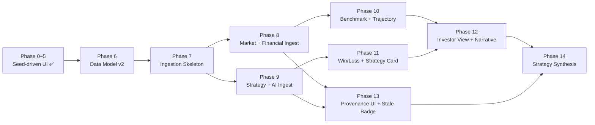

# Implementation Plan — OTA Competitive Intelligence Dashboard

**Version:** 2.0
**Last Updated:** 2026-05-21
**Source Specs:** [user_story.md](user_story.md) · [requirements.md](requirements.md) · [design.md](design.md)

---

## 1. Executive Summary

Build a world-map-based competitive intelligence dashboard that lets the OTA president **and** the broader organization make share-based decisions backed by real, up-to-date public data. Phases 0–5 delivered the seed-driven core (map, rival overlay, regional panel, KPI header, comparison view, time-period filter + CSV export). Phases 6–14 expand the scope per the v2 requirements and design:

1. **Provenance-backed data model** — every fact row carries a `source_id` (FR-08.6).
2. **Real-data ingestion layer** — Prefect + adapters for SEC EDGAR, HKEX, IR pages, UNWTO, JNTO, World Bank, IMF, Statista, Phocuswright, RSS, blogs, and career sites (FR-08).
3. **Self vs. Market Benchmark + Market Share Trajectory** (FR-04b, FR-06).
4. **Competitor Win/Loss + Rival Strategy & AI intelligence** (FR-02 extension, FR-08.3).
5. **Investor View preset + chart narratives + non-analyst accessibility** (FR-07).
6. **Provenance UI + stale-data warnings** (FR-08.6, NFR-01).
7. **Strategy Synthesis layer** — converts KPIs into actionable recommendations (the layer that fulfills the president's "escape the revenue up/down debate" mandate).

---

## 2. Tech Stack Decision

| Layer | Choice | Rationale |
|---|---|---|
| Frontend Framework | React 19 + TypeScript | Type safety, ecosystem maturity |
| Map Library | Leaflet (react-leaflet) | Open-source, free, and lightweight mapping |
| Charts | Recharts | Lightweight, React-native, composable |
| State Management | Zustand | Simple, minimal boilerplate for dashboard state |
| Backend API | Python + FastAPI | Fast prototyping, async I/O, auto-generated docs |
| Database | PostgreSQL + PostGIS | Relational + geospatial queries |
| Data Ingestion Orchestration | **Prefect** | Idempotent flows, scheduling, retries, observability (FR-08) |
| Raw Payload Store | **AWS S3** (or compatible) | 24-month retention of source HTML/PDF/XBRL (FR-08.5) |
| Financial Parsing | **`python-xbrl` + `pdfplumber` + `beautifulsoup4`** | XBRL → regex → LLM fallback chain (FR-08.2) |
| LLM Provider | **Claude API (Sonnet)** | Strategy summarization, AI-feature extraction, chart narratives (FR-08.3, FR-07) |
| Job Scheduler | Prefect schedules | Daily filings (6h), daily press (12h), weekly jobs, monthly market (NFR-01) |
| Alerting | Slack webhook | Layout-change & stale-data alerts (FR-08.5, NFR-01) |
| Hosting | Vercel (frontend) + Railway (backend) + Prefect Cloud / self-hosted Prefect Server | Fast deployment, free tier for prototype |

---

## 3. Phase Plan

### Phase 0 — Project Setup

**Goal:** Runnable skeleton, CI, and seed data loaded.

| Task | Output | Acceptance Criteria | Verification |
|---|---|---|---|
| Create monorepo structure | Repo scaffold | `/frontend`, `/backend`, `/data` folders exist | `ls -R` directory check |
| Configure Linting/TypeScript | Config files | Strict mode enabled, zero lint errors | `npm run lint` and `tsc --noEmit` |
| Set up PostgreSQL + PostGIS | DB running | Local and Railway instances accessible | `psql -c "SELECT version();"` |
| Database Migrations | `migrations/` | Schema matches Data Model (Section 4) | `\d` command to verify tables |
| Seed Database | Seed script | 9 rivals and 30 countries loaded | `SELECT COUNT(*)` count check |
| Configure CI/CD | Pipeline | Preview deployments active on Vercel | PR trigger + preview URL validation |

**Milestone:** `http://localhost:3000` loads a blank page and DB connectivity is confirmed.

---

### Phase 1 — Interactive World Map Core

**Goal:** Satisfy FR-01 fully.

| Task | Output | Acceptance | Verification |
|---|---|---|---|
| Leaflet Integration | Map renders | Map visible with OSM tiles | Manual visual check |
| Zoom / pan controls | Controls | Zoom 2–10 works smoothly | Manual interaction trace |
| Fetch /api/regions | Boundaries | All 195 borders drawn | Browser console: GeoJSON check |
| KPI Choropleth | Color layer | Dropdown switches KPI, colors update | Visual vs expected palette |
| Hover Tooltips | Tooltip | Appears within 200ms | Performance monitor (DevTools) |
| KPI Scale Unit Tests | Tests | 100% pass | `npm test` or `vitest` |

**Milestone:** World map with color-coded KPI choropleth is live in staging.

---

### Phase 2 — Rival Company Overlay ✅ [COMPLETED 2026-04-22]

**Goal:** Satisfy FR-02 fully.

| ID | Task | Output | Acceptance | Verification | Status |
|---|---|---|---|---|---|
| T-2.1 | Backend `/api/rivals` | [backend/app/routers/rivals.py](../backend/app/routers/rivals.py) | Returns JSON in < 200ms, supports `?category=` filter | `curl -sw '\n%{time_total}s\n' http://localhost:8000/api/rivals` | ✅ |
| T-2.2 | Rival markers | [RivalMarkersLayer.tsx](../frontend/src/components/RivalMarkersLayer.tsx) | 9 seed rivals visible as violet SVG pins | Visual marker count check at zoom ≥ 6 | ✅ |
| T-2.3 | Marker clustering | `leaflet.markercluster` via `useMap()` | No overlap at zoom < 5 (`maxClusterRadius: 80`) | Manual zoom-out verification | ✅ |
| T-2.4 | Rival summary card | [RivalSummaryCard.tsx](../frontend/src/components/RivalSummaryCard.tsx) | Card opens within 300ms on marker click; Esc + × close | Interaction profiling via DevTools | ✅ |
| T-2.5 | Category filters | [RivalCategoryFilter.tsx](../frontend/src/components/RivalCategoryFilter.tsx) + [rivalStore.ts](../frontend/src/stores/rivalStore.ts) | Toggling a chip adds/removes rivals of that category | Toggle each category manual test | ✅ |
| T-2.6 | Playwright E2E | [e2e/rivals.spec.ts](../frontend/e2e/rivals.spec.ts) + [playwright.config.ts](../frontend/playwright.config.ts) | `npm run test:e2e` exercises marker click, card open/close, chip toggle | `npx playwright install chromium && npm run test:e2e` | Scaffolded — runtime pending DB/browser |

**Milestone:** All 9 seed rivals are clickable on the map with summary cards, filterable by category, and covered by a Playwright smoke test.

---

### Phase 3 — Regional Characteristics Panel ✅ [COMPLETED 2026-04-22]

**Goal:** Satisfy FR-03 fully.

| ID | Task | Output | Acceptance | Verification | Status |
|---|---|---|---|---|---|
| T-3.1 | Backend `/api/regions/{iso}` | [backend/app/routers/regions.py](../backend/app/routers/regions.py) | Returns metrics + monthly_demand + demographics + top_routes + rival_ranking; 404 on unknown ISO | `curl -s http://localhost:8000/api/regions/FR \| jq` | ✅ |
| T-3.2 | Side panel slide-in | [RegionPanel.tsx](../frontend/src/components/RegionPanel.tsx) | Opens in < 400ms via 320ms CSS transform | Manual inspection of `region-panel-slide-in` keyframes | ✅ |
| T-3.3 | Seasonal demand chart | [DemandChart.tsx](../frontend/src/components/DemandChart.tsx) | 12-month Recharts `BarChart`; peaks synthesized from `demand_index` + hemisphere | Northern sample peaks in Jul, Southern in Jan | ✅ |
| T-3.4 | Demographics donut | [DemographicsDonut.tsx](../frontend/src/components/DemographicsDonut.tsx) + [demographics.ts](../frontend/src/utils/demographics.ts) | Segments re-normalize to sum to 100 | `npm test` — 7/7 donut-logic tests in [demographics.test.ts](../frontend/src/utils/demographics.test.ts) | ✅ |
| T-3.5 | Close / collapse UX | `closeRegion()` on Esc + × button | Panel dismounts; map retains bounds | Click-path manual test | ✅ |
| T-3.6 | Rival ranking table | [RivalRankingTable.tsx](../frontend/src/components/RivalRankingTable.tsx) + seed_update for [data/seeds/seed.py](../data/seeds/seed.py) | Dominant rival first; rows ≤ 7 per region; 30 × ~6 rows seeded | `SELECT COUNT(*) FROM rival_region_snapshots;` ≥ 150 | ✅ |

**Milestone:** Clicking any country opens a panel with demand chart, demographics donut, top routes, and rival ranking.

---

### Phase 4 — KPI Header + Comparison View ✅ [COMPLETED 2026-04-30]

**Goal:** Satisfy FR-04 and FR-05.

| ID | Task | Output | Acceptance | Verification | Status |
|---|---|---|---|---|---|
| T-4.1 | Backend `/api/kpis/global` | [backend/app/routers/kpis.py](../backend/app/routers/kpis.py) | Returns `markets_covered`, `tracked_rivals`, `hottest_growth_region`, `snapshot_month`; latency < 200ms | `curl -sw '\n%{time_total}s\n' http://localhost:8000/api/kpis/global` → 30 / 9 / US (92) / 2026-04-01 in 33ms | ✅ |
| T-4.2 | KPI header bar | [KpiHeaderBar.tsx](../frontend/src/components/KpiHeaderBar.tsx) + [api/globalKpis.ts](../frontend/src/api/globalKpis.ts) | Three-tile bar; "Tracked Rivals" recomputes live from `rivalStore.activeCategories` | Toggle category chips → `filteredRivalCount` re-renders without re-fetch | ✅ |
| T-4.3 | Multi-select picker | [ComparisonPicker.tsx](../frontend/src/components/ComparisonPicker.tsx) + [comparisonStore.ts](../frontend/src/stores/comparisonStore.ts) | Unlimited selection; chips removable; restricted to seeded regions; `<select>` disables only when every seeded region is already picked | `addRegion` no-ops on duplicates; dropdown shows only `demand_index !== null` regions | ✅ |
| T-4.4 | Comparison table | [ComparisonPanel.tsx](../frontend/src/components/ComparisonPanel.tsx) | 5 metric rows × N region columns aligned by `selectedIsos` order; renders only when ≥2 regions picked; panel auto-sizes with `min-width 520px` / `max-width calc(100vw - 32px)` and the table scrolls horizontally past that bound | `buildComparisonRows` unit tests assert column order and values per region | ✅ |
| T-4.5 | Highlight winner cell | [comparison.ts](../frontend/src/utils/comparison.ts) + [comparison.test.ts](../frontend/src/utils/comparison.test.ts) | Highest value gets `comparison-table__cell--winner` (green); ties produce no winner; null/NaN never wins | `npm test` — 13/13 comparison tests pass (37/37 total) | ✅ |

**Milestone:** President can compare up to 3 regions in a table with row-level winner highlighting; KPI header bar reflects rival-category filter live. Verified via `npm run lint`, `npm run build` (TS strict), `npm test` (37/37), and live `/api/kpis/global` curl.

#### Small Tweak Phase 4 ✅ [COMPLETED 2026-04-30]

**Situation:** the rival roster only carried B2C OTAs, and `rivals.category` was a single VARCHAR — it couldn't represent OTAs that operate in both segments.

**Resolution:**

- Schema: migration [0002_rival_multi_category.py](../backend/migrations/versions/0002_rival_multi_category.py) drops `category VARCHAR` and adds `categories VARCHAR[]`, backfilling each existing row's prior category as a single-element array.
- Model: [Rival.categories: ARRAY(String(50))](../backend/app/models/rival.py) replaces the scalar field.
- API: [routers/rivals.py](../backend/app/routers/rivals.py) filters via Postgres array overlap (`Rival.categories.overlap(...)`), so `?category=B2B` matches both pure-B2B rivals and dual-category ones.
- Seed: [seed.py](../data/seeds/seed.py) adds 6 new entries (Amadeus, Hotelbeds, TBO Tek, HRS, Riya Connect — pure B2B; Traveloka — both) and re-tags Expedia / Etraveli as `["B2C", "B2B"]` to reflect Expedia Partner Solutions and Etraveli's white-label arm.
- Frontend: [types.ts](../frontend/src/types.ts), [rivalStore.ts](../frontend/src/stores/rivalStore.ts), [RivalCategoryFilter.tsx](../frontend/src/components/RivalCategoryFilter.tsx), [RivalMarkersLayer.tsx](../frontend/src/components/RivalMarkersLayer.tsx), [RivalSummaryCard.tsx](../frontend/src/components/RivalSummaryCard.tsx), [KpiHeaderBar.tsx](../frontend/src/components/KpiHeaderBar.tsx), and [RivalRankingTable.tsx](../frontend/src/components/RivalRankingTable.tsx) all consume `categories: string[]`. Visibility is "any active category" (overlap semantics, mirroring the backend).

##### Acceptance Criteria

- [x] User can review both B2C and B2B OTAs (some categorized to **both**). Verified: `/api/rivals` returns 15 rivals; Expedia, Etraveli, Traveloka show `["B2C", "B2B"]`.
- [x] User can filter B2C and B2B OTAs. Verified: `/api/rivals?category=B2B` → 8 results (5 pure-B2B + 3 dual); `?category=B2C` → 10 results (7 pure-B2C + 3 dual).

**Verification:** `alembic upgrade head` (0001 → 0002), `python data/seeds/seed.py` (15 rivals / 30 regions / 175 snapshots), `npm run lint` clean, `npm run build` (TS strict) clean, `npm test` 37/37, live `/api/rivals?category=B2B|B2C` curl confirmed.

#### Small Tweak Phase 4b — Lift comparison cap ✅ [COMPLETED 2026-04-30]

**Situation:** the comparison view originally capped selection at 3 regions via a `COMPARISON_MAX` constant, and the panel had a fixed 520 px width — adding more regions would have crushed columns.

**Resolution:**

- [comparisonStore.ts](../frontend/src/stores/comparisonStore.ts) drops the `COMPARISON_MAX` constant and the cap guard in `addRegion`; duplicate-ISO suppression remains.
- [ComparisonPicker.tsx](../frontend/src/components/ComparisonPicker.tsx) removes the "max N reached" copy; the `<select>` now disables only once every seeded region is already picked.
- [index.css](../frontend/src/index.css) makes `.comparison-panel` `width: auto` with `min-width: 520px` and `max-width: calc(100vw - 32px)`; each region column gets `min-width: 130px`. The existing `.comparison-panel__scroll` `overflow: auto` takes over horizontal scroll once the table exceeds the panel's max-width.

##### Acceptance Criteria

- [x] User can compare more than 3 regions on the table — store no longer caps; dropdown stays enabled until every seeded region is selected.
- [x] The table extends properly as the number of compared countries increases — panel grows up to viewport, then the inner scroll wrapper scrolls horizontally; columns retain a 130 px minimum so values stay legible.

**Verification:** `npm run lint` clean, `npm run build` (TS strict) clean, `npm test` 37/37 (comparison logic is column-count-agnostic, so existing unit tests still validate the row construction).

---

### Phase 5 — Time-Period Filter + Export ✅ [COMPLETED 2026-04-30]

**Goal:** Satisfy FR-06.

| ID | Task | Output | Acceptance | Verification | Status |
|---|---|---|---|---|---|
| T-5.1 | Time range slider | [TimePeriodFilter.tsx](../frontend/src/components/TimePeriodFilter.tsx) + [timePeriodStore.ts](../frontend/src/stores/timePeriodStore.ts) | Range slider over the years returned by `/api/snapshots`; moving the handle re-fetches regions, region detail, KPI header, and comparison panel | Slider drives `selectedSnapshot`; every consumer effect re-runs against the new value | ✅ |
| T-5.2 | Ranking among Global OTAs | `global_rank` field added to each row of `rival_ranking` in [regions.py](../backend/app/routers/regions.py); shown alongside local rank in [RivalRankingTable.tsx](../frontend/src/components/RivalRankingTable.tsx) | Each region row shows local position **and** worldwide rank by booking volume; values match between region panel and DB | `curl /api/regions/US` → Expedia local #1 / global #1, Airbnb local #2 / global #6, etc. | ✅ |
| T-5.3 | Backend query param | `?snapshot_month=YYYY-MM-DD` accepted by [/api/regions](../backend/app/routers/regions.py), [/api/regions/{iso}](../backend/app/routers/regions.py), [/api/kpis/global](../backend/app/routers/kpis.py), and [/api/export](../backend/app/routers/export.py) via shared [snapshot.py](../backend/app/snapshot.py) helper | Bad date → 400 with explanatory message; missing param → falls back to latest snapshot in DB | `?snapshot_month=garbage` → `400 {"detail":"Invalid snapshot_month 'garbage'; expected YYYY-MM-DD."}` | ✅ |
| T-5.4 | New `/api/snapshots` | [routers/regions.py](../backend/app/routers/regions.py) | Returns `{ months: [...], latest }` so the frontend can populate the slider | `curl /api/snapshots` → 5 months 2022→2026 | ✅ |
| T-5.5 | Multi-year seed | [data/seeds/seed.py](../data/seeds/seed.py) | Yearly snapshots 2022→2026 with a deterministic recovery curve (`YEAR_MULTIPLIER`); rival assignments stable per region across years so ranks read as a clean trend | `python data/seeds/seed.py` → "5 distinct snapshot months"; US demand 72 → 92 across years | ✅ |
| T-5.6 | Backend `/api/export` | [routers/export.py](../backend/app/routers/export.py) | Returns `text/csv` with `Content-Disposition: attachment; filename="ota-export-<snap>.csv"`; columns: snapshot_month, iso_code, name, continent, demand_index, avg_booking_value, top_rival, top_rival_share_pct | `curl /api/export` → CSV header + 30 rows; `?snapshot_month=2022-04-01` re-renders with 2022 values | ✅ |
| T-5.7 | "Last updated" badge + Export CSV button | [KpiHeaderBar.tsx](../frontend/src/components/KpiHeaderBar.tsx) | Right-aligned column in the KPI header showing the active `snapshot_month` and a "Export CSV" link that downloads the same snapshot the dashboard is showing | Manual: badge updates with slider; button downloads `ota-export-2026-04-01.csv` | ✅ |

**Milestone:** Full filter + export flow works end-to-end. Verified via `npm run lint` clean, `npm run build` (TS strict) clean, `npm test` 37/37, multi-year `/api/kpis/global` curls, `/api/export` CSV inspection, and live `/api/regions/US` showing the new `global_rank` field.

---

### Phase 6 — Data Model Foundation & Source Registry ✅ [COMPLETED 2026-05-21]

**Goal:** Extend the data warehouse with the provenance-backed fact tables defined in [design.md § Data Model](design.md) so subsequent ingestion has a target schema. Maps to FR-08.6 (provenance), FR-08.4 (estimation flags).

| ID | Task | Output | Acceptance | Verification | Status |
|---|---|---|---|---|---|
| T-6.1 | Source registry table | [backend/app/models/source.py](../backend/app/models/source.py) + Alembic [0003_source_registry.py](../backend/migrations/versions/0003_source_registry.py) | `SOURCE(id, url, publisher, source_type, retrieved_at, raw_payload_ref, content_hash)` with unique constraint on `(url, content_hash)` + indexes on `source_type`, `retrieved_at` | `\d sources` confirms 7 columns + 3 indexes + unique constraint; FKs from 7 fact tables resolve to `sources.id` | ✅ |
| T-6.2 | Market growth + financial fact tables | [market_growth.py](../backend/app/models/market_growth.py), [rival_financial.py](../backend/app/models/rival_financial.py), [own_financial.py](../backend/app/models/own_financial.py) + Alembic [0004_financials.py](../backend/migrations/versions/0004_financials.py) | All three tables exist; every row carries `source_id` NOT NULL FK; FK uses default `RESTRICT` so a source can never be deleted while fact rows reference it | `\d market_growth rival_financial own_regional_financial`; SQLAlchemy metadata check asserts `source_id.nullable is False` | ✅ |
| T-6.3 | Market share estimate table | [market_share.py](../backend/app/models/market_share.py) + Alembic [0005_market_share.py](../backend/migrations/versions/0005_market_share.py) | Includes `is_estimated` bool NOT NULL + `calculation_method` text + `source_id` FK; partial index `WHERE is_estimated=true` | `\d market_share_estimate` shows partial index `ix_market_share_estimate_is_estimated`; unique constraint `(rival_id, region_iso, period_end, source_id)` present | ✅ |
| T-6.4 | Strategy event / AI feature / job posting tables | [strategy_event.py](../backend/app/models/strategy_event.py) (StrategyEvent + AIFeature), [job_posting.py](../backend/app/models/job_posting.py) + Alembic [0006_strategy.py](../backend/migrations/versions/0006_strategy.py) | Composite indexes `(rival_id, event_date)`, `(rival_id, launch_date)`, `(rival_id, snapshot_date)` | `\d strategy_event ai_feature job_posting_snapshot` confirms each index | ✅ |
| T-6.5 | Rival metadata expansion | `Rival.ticker`, `exchange`, `strategy_summary`, `summary_updated_at` columns in [models/rival.py](../backend/app/models/rival.py) + Alembic [0007_rival_metadata.py](../backend/migrations/versions/0007_rival_metadata.py) | All four columns nullable; existing 15 rows preserved | Seed re-runs cleanly with `15 rivals, 30 regions, 175 snapshots`; new columns return NULL pending Phase 8 backfill | ✅ |
| T-6.6 | Provenance contract validator | [backend/scripts/validate_provenance.py](../backend/scripts/validate_provenance.py) | Scans all 7 fact tables; exits 0 if every row has `source_id`, exits 1 with table-by-table breakdown otherwise; skips tables not yet migrated | Negative test: temporarily drop NOT NULL, insert NULL-source row → validator reports `market_growth: 1 unsourced row(s)`, exits 1; restore + delete → exits 0 | ✅ |
| T-6.7 | Seed data → source-tagged | [data/seeds/seed.py](../data/seeds/seed.py) inserts a single `SOURCE(source_type='seed', publisher='internal-seed', url='internal://seed/phase-0-5', content_hash='phase-0-5-seed-v1')` row idempotently via the `(url, content_hash)` unique constraint | Re-running seed converges to exactly 1 seed-typed source row; Phase 1–5 endpoints respond unchanged | `python ../data/seeds/seed.py` twice → same seed source `id`; `GET /api/{healthz,snapshots,kpis/global,regions/US,rivals}` all return 200 | ✅ |

**Milestone:** `alembic upgrade head` brings the warehouse from 0002 → 0007 in five sequential steps; `validate_provenance.py` passes; existing Phase 1–5 endpoints respond unchanged. Verified via `alembic upgrade head` (5 migrations applied), `python ../data/seeds/seed.py` (15 rivals / 30 regions / 175 snapshots, 1 internal-seed source row), `python scripts/validate_provenance.py` exits 0, and live curls to `/healthz`, `/api/snapshots`, `/api/kpis/global`, `/api/regions/US`, `/api/rivals` all returning 200.

---

### Phase 7 — Ingestion Pipeline Skeleton

**Goal:** Stand up the `ingestion/` directory with a runnable Prefect flow, S3-backed raw payload store, Source provenance recorder, and layout-change alerting. No production adapters yet — one synthetic "echo" adapter proves the pipeline end-to-end. Maps to FR-08.5 and FR-08.6.

| ID | Task | Output | Acceptance | Verification | Status |
|---|---|---|---|---|---|
| T-7.1 | Prefect harness | `ingestion/__init__.py`, `ingestion/requirements.txt` (`prefect`, `boto3`, `pdfplumber`, `beautifulsoup4`, `python-xbrl`, `anthropic`), `ingestion/flows/__init__.py` | `prefect server start` runs locally; a hello-world flow registers | `prefect deployment ls` shows the test flow | Pending |
| T-7.2 | Raw payload store | `ingestion/raw_store/s3_client.py` | Writes `s3://ota-raw/<source_type>/<yyyy>/<mm>/<sha256>.bin`; reads by content hash; configurable lifecycle = 24 months | Unit test round-trips a payload and verifies key format | Pending |
| T-7.3 | Provenance recorder | `ingestion/provenance/recorder.py` | Idempotent `record(url, publisher, source_type, raw_payload_ref) -> source_id`; same `content_hash` → same `source_id` | Unit test asserts second call returns same id; no duplicate `SOURCE` row | Pending |
| T-7.4 | Layout-change detector | `ingestion/monitor/layout_change_detector.py` + `alerts.py` | Computes DOM-skeleton hash (or XBRL tag-count fingerprint); if hash differs from last 5 runs, fires Slack-webhook alert and **skips upsert** | Test injects mutated HTML fixture → alert fired, no row written | Pending |
| T-7.5 | Echo adapter end-to-end | `ingestion/adapters/echo.py` + `flows/echo_flow.py` | Pulls a fixed local fixture, persists raw payload, records source, returns synthetic fact rows, upserts via idempotency helper | `prefect deployment run echo` exits 0; 1 `SOURCE` row + 1 S3 object exist | Pending |
| T-7.6 | Idempotent upsert helper | `ingestion/normalizer/schema.py` — `upsert(table, natural_key, payload)` | Running echo flow twice produces 1 `SOURCE` row + 0 duplicate fact rows | Run twice; `SELECT COUNT(*)` unchanged | Pending |
| T-7.7 | robots.txt + rate-limit middleware | `ingestion/adapters/_http.py` | Every adapter goes through this client; per-host token bucket; respects `Crawl-delay` | Test against a blocked path → adapter returns "skipped, robots.txt disallow" | Pending |

**Milestone:** Ingestion runtime is provable end-to-end with a synthetic adapter; provenance, raw retention, layout-change alerts, and rate limits all work; no production data yet.

---

### Phase 8 — Market & Financial Data Ingestion

**Goal:** Replace seed-driven market data with real public data. Maps to FR-08.1 (market data), FR-08.2 (rival financials), and FR-08.4 (market-share estimation).

| ID | Task | Output | Acceptance | Verification | Status |
|---|---|---|---|---|---|
| T-8.1 | UNWTO adapter | `ingestion/adapters/unwto.py` | Pulls regional tourism receipts for last 5 years; writes `MARKET_GROWTH` rows with `publisher='UNWTO'` | `SELECT region_iso, year, market_size_usd, growth_rate_pct FROM market_growth WHERE region_iso='JP';` returns ≥5 rows, `source_id` non-null | Pending |
| T-8.2 | JNTO + World Bank + IMF adapters | `jnto.py`, `world_bank.py`, `imf.py` | JNTO populates JP monthly arrivals; World Bank populates GDP; IMF populates FX rates | Spot-check 2024 USD/JPY against the row in DB; diff < 0.5% | Pending |
| T-8.3 | Industry research adapter | `industry_research.py` (Statista + Phocuswright + Skift open content) | Fills gaps where UNWTO lacks coverage; rows tagged by publisher | Acceptance ≥ 2 sources per region per year (per requirements.md AC) — verified by `HAVING COUNT(DISTINCT publisher) ≥ 2` | Pending |
| T-8.4 | SEC EDGAR adapter | `sec_edgar.py` | Pulls 10-K + 10-Q + 20-F for Booking, Expedia, Airbnb; parses XBRL revenue, operating income, segment revenue | `SELECT rivals.name, period_end, revenue_usd, take_rate_pct FROM rival_financial JOIN rivals USING (...) ORDER BY period_end DESC LIMIT 5;` returns latest filings | Pending |
| T-8.5 | HKEX adapter (Trip.com) | `hkex.py` | Parses Trip.com semi-annual + interim disclosures from HKEX | Latest 4 periods present for Trip.com | Pending |
| T-8.6 | Generic IR adapter for non-XBRL filers | `ir_page.py` + `pdf_report.py` | Handles HTML earnings pages + PDF reports; uses XBRL > regex > LLM fallback per design § Ingestion principle 6 | Top-5 rivals have non-null `revenue_usd` for most recent quarter | Pending |
| T-8.7 | Market share estimator | `backend/app/services/share_estimator.py` | Implements `share_pct = (rival_total_revenue × regional_revenue_weight) / regional_market_size`; writes `MARKET_SHARE_ESTIMATE` with `is_estimated=true` + `calculation_method` text | Disclosed Booking US share is non-estimated; derived Booking IN share is flagged + method visible | Pending |
| T-8.8 | `monthly_market.py` flow | `ingestion/flows/monthly_market.py` | Orchestrates T-8.1–T-8.3 sequentially; idempotent on `(source, region, year)` | Run twice → no duplicate `MARKET_GROWTH` rows | Pending |
| T-8.9 | `daily_filings.py` flow | `ingestion/flows/daily_filings.py` | Triggers every 6h (NFR-01 24h SLA); deduplicates filings by SEC `accession_number` | Stub clock 24h forward; latest 10-Q for Booking ingested within SLA | Pending |

**Milestone:** Dashboard KPIs (TAM, Market Growth Rate, Own/Rival Take Rate, Op Margin) are sourced from real public data with `source_id` traceability. Requirements AC "automated ingestion pipeline retrieves market data from at least 2 distinct public sources per region" passes.

---

### Phase 9 — Strategy & AI Intelligence Ingestion

**Goal:** Populate `STRATEGY_EVENT`, `AI_FEATURE`, and `JOB_POSTING_SNAPSHOT` with LLM-extracted intelligence from rival public communications. Maps to FR-08.3.

| ID | Task | Output | Acceptance | Verification | Status |
|---|---|---|---|---|---|
| T-9.1 | Press RSS + corporate blog adapters | `ingestion/adapters/press_rss.py`, `corporate_blog.py` | Subscribes to RSS for top-10 rivals; persists raw HTML to S3 | ≥1 fresh press release per top-5 rival in trailing 7 days | Pending |
| T-9.2 | Strategy summarizer (LLM) | `ingestion/extractors/strategy_extractor.py` (Claude Sonnet) | Generates one-paragraph `Rival.strategy_summary`; prompt requires `[source: <url>]` markers in output | `rivals.strategy_summary` non-null for ≥10 rivals; `summary_updated_at` within 48h | Pending |
| T-9.3 | AI feature detector | `extractors/ai_feature_extractor.py` | Identifies AI-feature launches from press; populates `AI_FEATURE(launch_date, feature_name, description, source_id)` | ≥1 AI feature in last 12 months for Booking, Expedia, Trip.com, Airbnb | Pending |
| T-9.4 | Job board adapter | `adapters/job_board.py` | Scrapes rival career pages weekly; computes `ml_eng_count / total_open_roles` ratio | `JOB_POSTING_SNAPSHOT` populated for ≥5 rivals across ≥2 weeks | Pending |
| T-9.5 | `daily_press.py` flow | `ingestion/flows/daily_press.py` | Orchestrates T-9.1–T-9.3 every 12h; rate-limits per host | Run twice → `strategy_summary` updates only when content hash changed | Pending |
| T-9.6 | `weekly_jobs.py` flow | `ingestion/flows/weekly_jobs.py` | Triggers weekly; idempotent on `(rival_id, snapshot_date)` | `SELECT COUNT(DISTINCT snapshot_date) FROM job_posting_snapshot;` ≥ 2 after two weeks | Pending |
| T-9.7 | Source-citation guard | LLM-output validator in `strategy_extractor.py` | Rejects summaries missing `[source: <url>]` markers | Unit test: malformed LLM response raises `MissingSourceCitation` | Pending |

**Milestone:** Requirements AC "automated job ingests rival press releases and blog posts at least daily and produces an LLM-generated strategy summary per rival with source citations" passes end-to-end.

---

### Phase 10 — Self vs. Market Benchmark + Market Share Trajectory

**Goal:** Satisfy FR-04b (self vs market) and FR-06's new trajectory requirement using the real data delivered in Phases 8–9.

| ID | Task | Output | Acceptance | Verification | Status |
|---|---|---|---|---|---|
| T-10.1 | Backend `/api/benchmark` | `backend/app/routers/benchmark.py` + `services/benchmark_service.py` | Returns `{ region_iso, period, own_growth, market_growth, outperformance_pp, narrative, source_ids[] }`; latency < 300ms | `curl /api/benchmark?region=JP&period=2025-Q4` → outperformance computed = own − market | Pending |
| T-10.2 | Backend `/api/share-trajectory` | `routers/share_trajectory.py` + `services/trajectory_service.py` | Returns time-series of own share + top-5 rivals per region; computes per-series regression slope; latency < 400ms | `curl /api/share-trajectory?region=US&from=2022&to=2026` returns ≥5 points per series | Pending |
| T-10.3 | `SelfVsMarketChart.tsx` | Recharts dual-bar chart (own growth vs market growth) with colored gap band | Beating → green band, losing → red band; tooltip shows narrative + source links | Manual: a known-winning region vs known-losing region show opposite colors | Pending |
| T-10.4 | `ShareTrajectoryChart.tsx` | Recharts LineChart; own + top-5 rivals; period selector reads `timeRangeStore` | Each rival's line color matches their Win/Loss label (set in Phase 11); slope label uses `trajectoryMath.ts` | `npm test` covers `trajectoryMath` slope on synthetic data | Pending |
| T-10.5 | `benchmarkMath.ts` + `trajectoryMath.ts` | Pure utility libs | ≥90% branch coverage | `npm test` includes them in coverage report | Pending |
| T-10.6 | Template-fallback narrative | Backend returns template-based narrative until Phase 12's LLM service is live | e.g. "Our APAC revenue grew 8% while the market grew 12% — we lost 4 percentage points of relative position" | Playwright assert: narrative text contains "lost" or "gained" with magnitude | Pending |

**Milestone:** AC "Self vs. market benchmark chart renders" and "Market share trajectory time-series chart renders our company and at least the top 5 rivals" pass.

---

### Phase 11 — Competitor Win/Loss Panel + Rival Strategy Card

**Goal:** Satisfy the new FR-02 win/loss requirement and surface FR-08.3 intelligence in the UI.

| ID | Task | Output | Acceptance | Verification | Status |
|---|---|---|---|---|---|
| T-11.1 | Backend `/api/win-loss` | `routers/win_loss.py` + `services/win_loss_service.py` | Returns per-region rival list with `share_delta_pp`, `label ∈ {Gainer, Loser, Stable}` per design § KPI Catalog | `curl /api/win-loss?region=US&period=2026` → top-3 gainers + top-3 losers | Pending |
| T-11.2 | `WinLossPanel.tsx` | Two-column panel (Gainers / Losers); click-through to `RivalStrategyCard` | Color-coded chips; sticky-top for top-3 gainers; integrates with region-panel host | Manual: a known gainer appears in the gainer column | Pending |
| T-11.3 | Backend `/api/strategy/{rival_id}` | `routers/strategy.py` | Returns `strategy_summary`, `ai_features[]`, `recent_strategy_events[]`, all with `source_id`s | `curl /api/strategy/<booking_uuid>` returns ≥1 AI feature with a source URL | Pending |
| T-11.4 | `RivalStrategyCard.tsx` | Replaces the existing `RivalSummaryCard` for win/loss flow; tabs for Strategy / AI Features / Events | Each item shows publisher + retrieved_at + "View source" affordance (wired in Phase 13) | Click "View source" opens `ViewSourceModal` (Phase 13 stub OK) | Pending |
| T-11.5 | Win/Loss labeling unit tests | `services/win_loss_service.py` test suite | Δ = +0.6pp → Gainer, +0.3pp → Stable, −0.7pp → Loser; ties handled deterministically | `pytest backend/tests/test_win_loss_service.py` 100% pass | Pending |
| T-11.6 | Map marker enrichment | `RivalMarkersLayer.tsx` adds a Gainer/Loser ring around each rival pin in the active region | Visual: gainer ring is green, loser ring red, stable grey | Manual zoom into a region | Pending |

**Milestone:** AC "Competitor win/loss trend view labels each tracked rival as a share-gainer or share-loser" passes; clicking a gainer surfaces their strategy and AI features.

---

### Phase 12 — Investor View Preset + Chart Narratives

**Goal:** Satisfy FR-07 (company-wide accessibility, ≤200-char narratives, Investor View preset).

| ID | Task | Output | Acceptance | Verification | Status |
|---|---|---|---|---|---|
| T-12.1 | Backend `/api/narrative` | `routers/narrative.py` + `services/narrative_service.py` (Claude Sonnet) | Generates ≤200-char narrative per `chart_id × region × period`; cached 6h; returns supporting `source_ids[]` | `curl /api/narrative?chart=self_vs_market&region=JP` → text length ≤ 200, ≥1 source_id | Pending |
| T-12.2 | `ChartNarrative.tsx` | Sub-component wrapped around every major chart | Shows narrative + "View source" links; null narrative → "Generating insight..." placeholder | Storybook stories for both states | Pending |
| T-12.3 | `InvestorViewPreset.tsx` + `investorViewStore.ts` | Toggle in `KpiHeader.tsx`; when on, dashboard renders only Self-vs-Market, Share Trajectory, Top-3 Win/Loss Δ | Toggle persists in `localStorage`; Playwright covers the toggle path | Playwright: toggle on → only 3 panels visible; toggle off → restore previous state | Pending |
| T-12.4 | Non-analyst usability validation | UAT walkthrough + 1-page interpretation cheatsheet linked from `KpiHeader` | Non-finance team member reads Self-vs-Market chart and explains the gap unaided | UAT session log appended to docs/walkthrough.md | Pending |
| T-12.5 | LLM cost guardrail | `narrative_service` cache + max 50 regenerations per day | When budget exceeded → template fallback used; ops alert sent | Test that exceeds limit triggers fallback path | Pending |
| T-12.6 | Locale toggle for narratives | Backend accepts `?lang=ja\|en`; Japanese narratives generated for IR向けビュー | Same chart_id in `lang=ja` returns Japanese text ≤200 chars | `curl ?lang=ja` returns Japanese | Pending |

**Milestone:** AC "Investor View preset is selectable" and "Every major chart displays a plain-language narrative (≤200 chars)" pass.

---

### Phase 13 — Provenance UI + Stale Data Badge

**Goal:** Satisfy FR-08.6 (View Source everywhere) and NFR-01 (stale-data warning at 2× expected cadence).

| ID | Task | Output | Acceptance | Verification | Status |
|---|---|---|---|---|---|
| T-13.1 | Backend `/api/sources/{id}` | `routers/sources.py` | Returns `{ url, publisher, source_type, retrieved_at, raw_payload_ref, content_hash }`; raw_payload_ref returns a presigned S3 URL | `curl /api/sources/<uuid>` returns 200; clicking link downloads original payload | Pending |
| T-13.2 | `ViewSourceModal.tsx` | Modal opened from any chart/KPI; lists every contributing source with timestamps | If value is estimated → modal shows `calculation_method` + an "Estimated" badge | Manual: TAM number → modal lists UNWTO + Statista | Pending |
| T-13.3 | `StaleDataBadge.tsx` + `backend/app/services/freshness_service.py` | Backend exposes age per KPI; frontend renders red/amber badge when age > 2× cadence | Earnings older than 48h → red; market data older than 60d → red; jobs older than 14d → red | Inject stub clock; assert badge appears on the relevant chart | Pending |
| T-13.4 | Provenance contract on every endpoint | All `/api/*` responses include `source_ids[]` for each KPI value or aggregate | Schema-level test asserts no number is returned without ≥1 `source_id` | `pytest backend/tests/test_provenance_contract.py` passes for every router | Pending |
| T-13.5 | Estimated-value badge propagation | `MARKET_SHARE_ESTIMATE.is_estimated=true` rows render an "estimated" pill everywhere they appear | Win/Loss panel, trajectory chart, strategy card all show the pill | Visual regression test for a known-estimated rival/region pair | Pending |

**Milestone:** AC "Every figure on the dashboard exposes a 'View source' action" and "A 'stale data' warning is rendered whenever any displayed figure exceeds twice its expected refresh cadence" both pass.

---

### Phase 14 — Strategy Synthesis Layer

**Goal:** Convert raw KPIs into actionable recommendations per the five synthesis rules in [design.md § Strategy Synthesis](design.md). This is the capstone that fulfills the president's "escape the revenue up/down debate" mandate.

| ID | Task | Output | Acceptance | Verification | Status |
|---|---|---|---|---|---|
| T-14.1 | Position Diagnosis service | `backend/app/services/synthesis/position_diagnosis.py` | Per region classifies as `Winning`, `Losing`, `Stable`; drives chart color and narrative verb | Unit test: outperformance +2pp → `Winning`; −2pp → `Losing`; ±0.5pp → `Stable` | Pending |
| T-14.2 | Rival Targeting service | `services/synthesis/rival_targeting.py` | For losing regions, picks the rival with highest positive Share Δ and returns their `strategy_summary` + recent `ai_features` | E2E: in a synthetic losing region the surfaced rival matches the largest gainer | Pending |
| T-14.3 | AI Capability Gap | `services/synthesis/ai_gap.py` | Categorizes AI features (pricing, search, customer service, supply optimization); returns categories present in top-3 rivals but absent for us | Unit test: own=[pricing], rivals=[pricing, search] → gap=[search] | Pending |
| T-14.4 | Region Prioritization | `services/synthesis/region_priority.py` | Returns regions ranked by `score = TAM × Market Growth Rate × (target_share − current_share)`; `target_share` configurable per region | `curl /api/synthesis/priorities` returns ranked list, highest score first | Pending |
| T-14.5 | Aggregated `/api/synthesis/recommendation` | `routers/synthesis.py` | Returns `{ position, targeted_rival, ai_gap, priority_rank, recommendation_narrative, source_ids[] }` for a given region | A known-losing region returns non-empty `targeted_rival` + AI gap | Pending |
| T-14.6 | "Recommended next move" banner in Investor View | Frontend banner in `InvestorViewPreset.tsx` | Reads `/api/synthesis/recommendation`; renders a one-sentence recommendation + source links | Manual: banner reads e.g. "Invest in dynamic-pricing AI to close Booking's 4pp APAC lead." | Pending |
| T-14.7 | Synthesis explainability log | `services/synthesis/_explain.py` | Every recommendation persists its inputs (KPI deltas, rival picked, gap list) to an `audit_log` table for review | `SELECT * FROM synthesis_audit_log ORDER BY created_at DESC LIMIT 1;` shows the inputs | Pending |

**Milestone:** Any employee opening the dashboard can navigate from a KPI to a concrete recommendation, with every claim backed by source links. The dashboard transitions from a passive data display to an active strategy tool — satisfying the president's vision that the system should help employees discuss positioning, not just revenue trends.

---

## 4. Cross-Phase Dependencies

- **Phases 8 and 9 can run in parallel** once Phase 7 lands — they share the ingestion skeleton but write to disjoint tables.
- **Phase 10 depends only on Phase 8** data; **Phase 11 depends on Phase 9**; this lets two squads work in parallel after the ingestion landing.
- **Phase 12 depends on both 10 and 11** because the LLM narrative reads benchmark + win/loss inputs.
- **Phase 13 is decoupled** from the chart phases but should land before Phase 12 ships externally — otherwise users see numbers without provenance.
- **Phase 14 is the capstone** and assumes all upstream KPIs are flowing with real data.

---

## 5. Risk Register (v2 scope additions)

| Risk | Mitigation | Owner |
|---|---|---|
| Rival IR pages change layout silently → wrong financials in DB | Layout-change detector (T-7.4) + raw-payload retention (T-7.2) for reprocessing | Ingestion |
| LLM hallucinates strategy summaries | Source-citation guard (T-9.7) + human review queue for first 30 days; LLM-as-fallback policy keeps financials deterministic | Data |
| Market data sources disagree (UNWTO vs Statista) | Store all sources; show range in `ViewSourceModal`; HHI / share denominators picked from highest-trust source per region | Data |
| LLM cost explosion on narrative endpoint | Cache + daily budget cap (T-12.5) with template fallback | Backend |
| Estimated market shares (FR-08.4) misunderstood as disclosed | "Estimated" pill propagated to every surface (T-13.5); calculation method shown on hover | Frontend |
| Time-to-data on a fresh rival is too long | Phase 7's echo adapter is the integration template — new rivals add an adapter in < 1 day | Ingestion |
